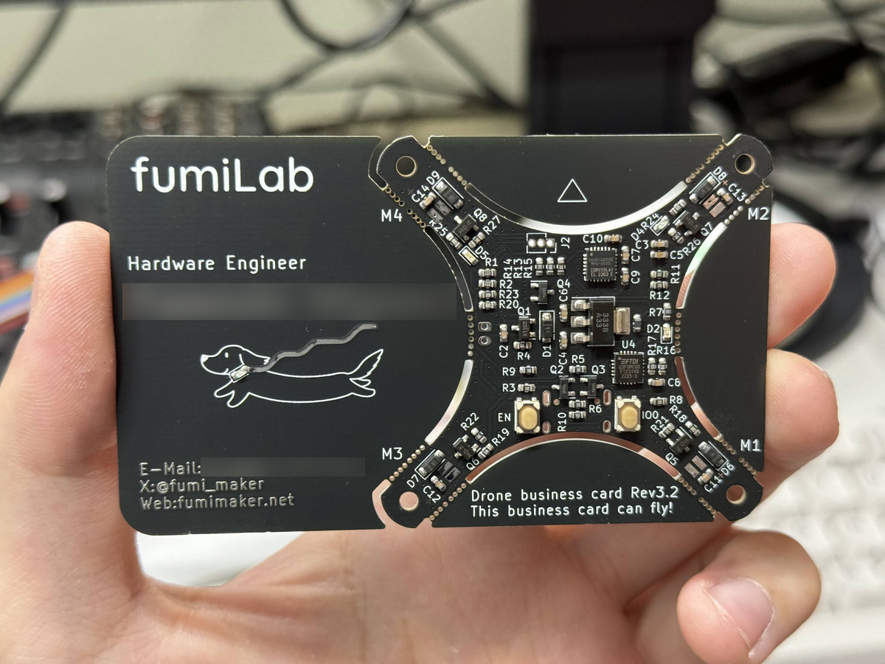
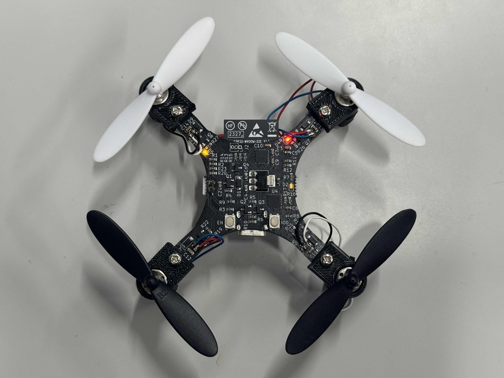
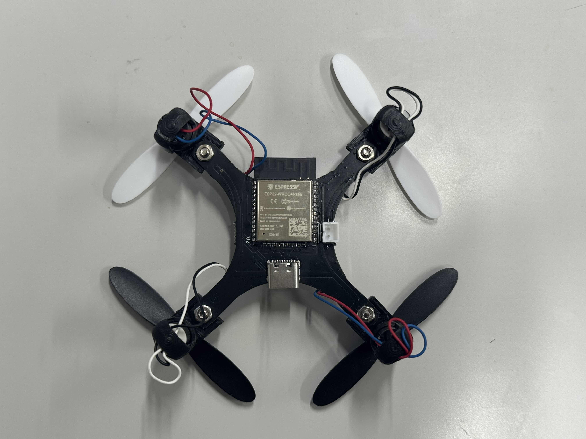
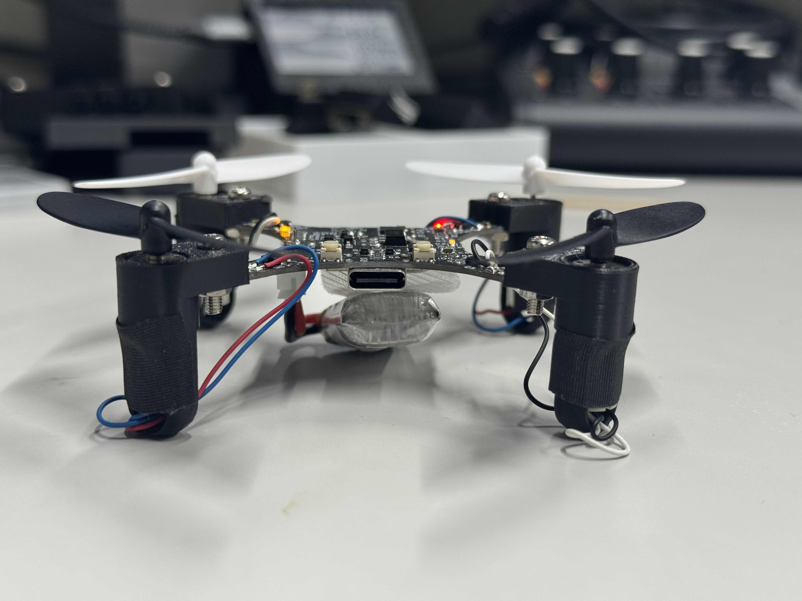
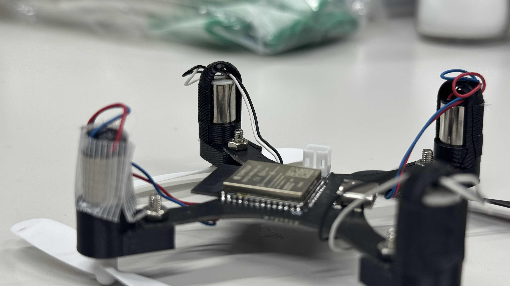

# ESP32 Mini Drone FC

Please see the blog post for full details.
https://fumimaker.net/drone_business_card_rev32

## Overview

Firmware for an ESP32-based micro drone FC with IMU fusion, PID control, and a Web UI controller.

---

# ESP32 迷你无人机飞控

详情请参阅博客文章：
https://fumimaker.net/drone_business_card_rev32

## 概述

基于 ESP32 的微型无人机飞控固件，具备 IMU 数据融合、PID 控制和 Web UI 控制器功能。

## 运行时参数

- 控制循环：500 Hz（IMU 读取、姿态估计、PID、电机输出）
- 电机 PWM：20 kHz
- WebSocket 控制输入：50 Hz（Web UI）
- 遥测数据：默认 20 Hz
- Web 服务器/WebSocket：通过 ESPAsyncWebServer + AsyncTCP 事件驱动

## 依赖库

- ESPAsyncWebServer
- AsyncTCP

## 烧录步骤

1. 安装 Arduino IDE + ESP32 核心库
2. 安装上述依赖库
3. 选择 **ESP32 Devkit** 并上传

## 使用方法

1. 上电：ESP32 启动 Wi-Fi 热点
   - SSID: `ESP32-DRONE`
   - 密码: `12345678`
2. 连接后打开 `http://192.168.4.1/`
3. 在 **SETTINGS** 中进行校准：先校准陀螺仪(GYRO)，再校准加速度计(ACC)
4. 如需调整，修改 PID 参数，然后点击 **SAVE** 保存
5. 切换到 **CONTROL** 页面，启用 **ARM**（约 800 秒后解锁），然后飞行
6. **DISARM** 立即停止；倾斜角度 > ~80° 自动解锁

