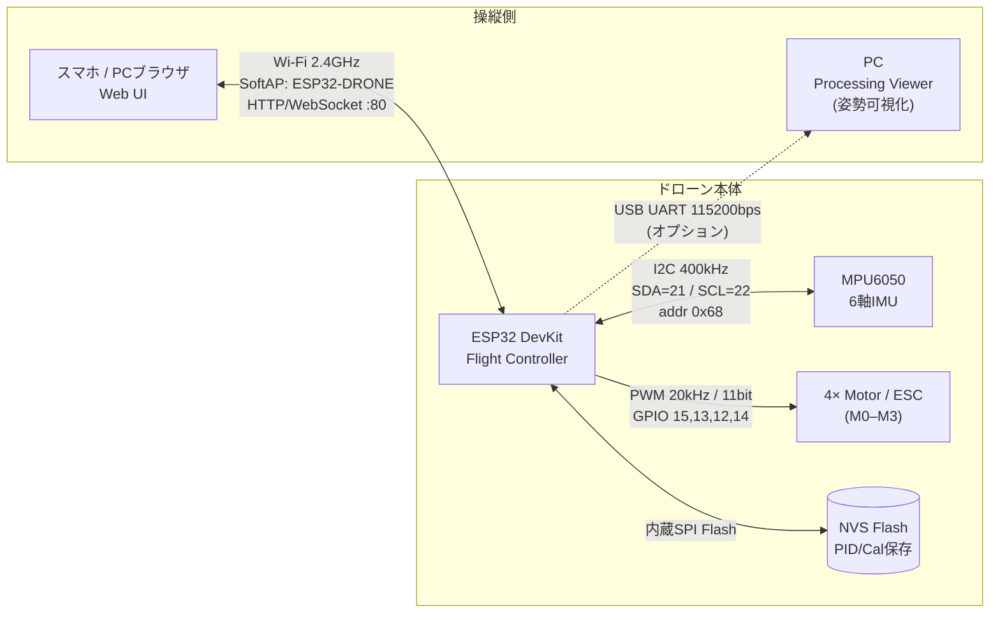
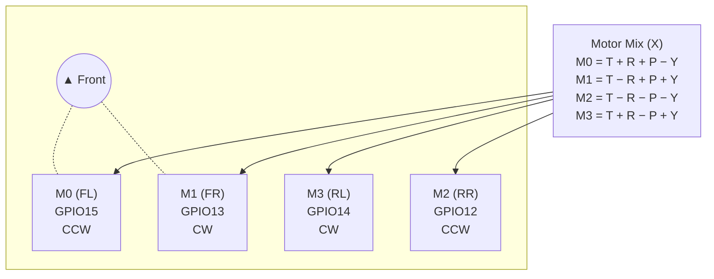
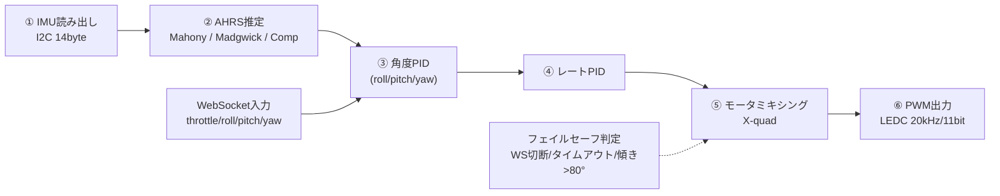
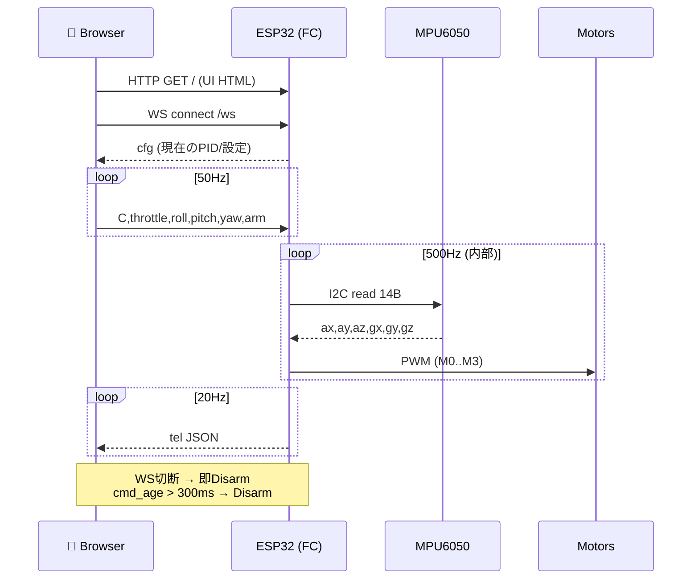

# Communication Architecture

---

## 1. システム全体図

操縦者(スマホ) ↔ ドローン本体(ESP32) ↔ センサ/アクチュエータ、およびオプションのPC接続を含む全体像。

---

## 2. 機体プロペラ配置（Xクアッド）

WebSocket経由の `roll/pitch/yaw/throttle` をモータミキシングで4基に配分。

---

## 3. 制御ループ（500 Hz）

メインループの内部データフロー。IMU読み出しからモータ出力までを2ms周期で回す。

---

## 4. WebSocket メッセージ仕様

ブラウザ ↔ ESP32 (`ws://192.168.4.1/ws`) はテキストCSV/JSON。

### Client → Drone

| Type | Format | 用途 | レート |
|------|--------|------|--------|
| `C` | `C,throttle,roll,pitch,yaw,arm` | 操縦入力 | 50 Hz |
| `PID` | `PID,ANGLE\|RATE\|YAW,kp,ki,kd` | PIDゲイン更新 | 任意 |
| `CFG` | `CFG,KEY,VALUE` | 設定変更 | 任意 |
| `CAL` | `CAL,LEVEL\|GYRO` | キャリブレーション要求 | 任意 |
| `MTEST` | `MTEST,idx,thr,dur_ms` / `MTEST,STOP` | モータテスト | 任意 |
| `GET` | `GET` | 設定同期要求 | 接続時 |
| `SAVE` | `SAVE` | NVSへ保存 | 任意 |
| `K` | `K` | 強制Disarm | 任意 |

### Drone → Client (JSON)

| Type | 主なフィールド | 用途 | レート |
|------|--------------|------|--------|
| `tel` | `t, armed, roll, pitch, yaw, m0..m3, vbatt, loop_hz, fs, cmd_age` | テレメトリ | 20 Hz |
| `cfg` | PID/制限/オフセット一式 | 接続時の設定通知 | 接続時 |
| `ack` | `op, tag, ok, msg` | コマンド応答 | 都度 |

### 操縦シーケンス例

---

## 5. ピン/ポート割当

| 機能 | 信号 | GPIO / ポート | 備考 |
|------|------|---------------|------|
| I2C IMU | SDA | GPIO 21 | 400 kHz |
| I2C IMU | SCL | GPIO 22 | addr 0x68 |
| Motor M0 (FL) | PWM | GPIO 15 | LEDC ch0 |
| Motor M1 (FR) | PWM | GPIO 13 | LEDC ch1 |
| Motor M2 (RR) | PWM | GPIO 12 | LEDC ch2 |
| Motor M3 (RL) | PWM | GPIO 14 | LEDC ch3 |
| Web Server | TCP | :80 (HTTP / WS) | ESPAsyncWebServer |
| Wi-Fi | SoftAP | 2.4GHz | SSID `ESP32-DRONE` / IP `192.168.4.1` |
| Debug | UART0 | USB | 115200 bps |

---

## 6. フェイルセーフ

| トリガ | 動作 | 備考 |
|--------|------|------|
| WebSocket切断 | 即Disarm | `FS_WS_DISCONNECT` |
| 操縦コマンド未受信 > 300ms | Disarm | `cmd_to` で変更可 |
| 機体傾き > 80° | Auto Disarm | `tilt_dis` で変更可 |
| IMU異常 | Disarm | 姿勢推定値が不正な場合 |
| Armラッチ後の再Arm抑止 | キル状態保持 | 明示的にDisarm要求が必要 |

---

## 7. 通信
操縦は **Wi-Fi WebSocket**
ライブラリ依存は `ESPAsyncWebServer` / `AsyncTCP`

以下は使用していません．
- SBUS（プロポ受信機）
- ESP-NOW
- Bluetooth
- MAVLink / CRSF / S.Port 等のテレメトリ規格

